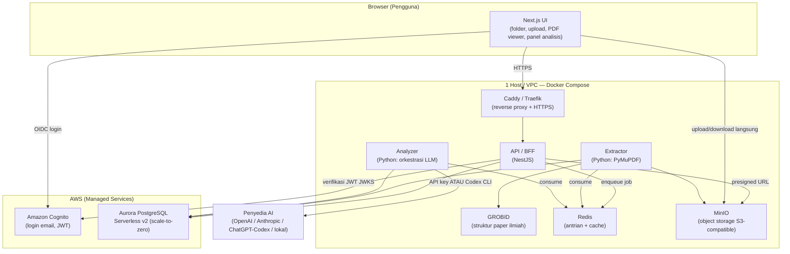
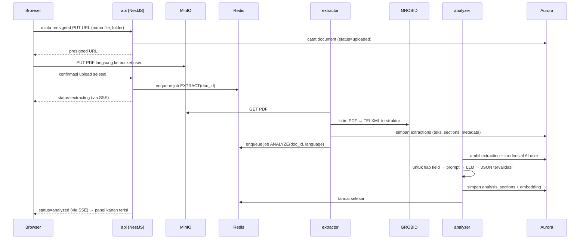

# PDFHo!mes — Rencana Arsitektur & Implementasi Lengkap

> **PDFHo!mes** (dibaca *"PDF Holmes"*) — platform web untuk membedah artikel riset (PDF) menjadi analisis terstruktur yang mendalam, lengkap dengan deteksi *research gap*, dalam bahasa pilihan pengguna.

Dokumen ini adalah cetak biru (blueprint) end-to-end: arsitektur, tech stack, rincian service, skema database, desain AI yang fleksibel (API key **atau** Codex/ChatGPT auth), setup AWS (Cognito + Aurora), struktur Docker, deployment hemat untuk kredit \$100, sampai roadmap bertahap.

---

## 1. Visi & Ringkasan Produk

PDFHo!mes membantu peneliti "menginterogasi" sebuah paper layaknya Sherlock Holmes memeriksa bukti. Alur inti dari sudut pandang pengguna:

1. Login dengan email.
2. Membuat folder dan mengunggah PDF artikel riset ke dalamnya.
3. Mengklik sebuah PDF → muncul *viewer* PDF di kiri dan panel analisis di kanan.
4. Panel kanan menampilkan analisis terstruktur, **setiap aspek di field-nya sendiri** (latar belakang, rumusan masalah, metodologi, hasil, evaluasi, kesimpulan, *research gap*, dll.), dalam **bahasa yang dipilih pengguna**.
5. Semua field hasil analisis tersimpan di database (Aurora) sehingga bisa dibuka kembali, dicari, dan dibandingkan antar-paper.

Pembeda utama dibanding "ringkas PDF biasa": output berorientasi kebutuhan riset (gap, novelty, reproduktibilitas, *critical appraisal*), bukan sekadar rangkuman naratif.

---

## 2. Klarifikasi Konsep "Container di dalam Container"

Pada deskripsi awal disebut *"service terpisah-pisah namun dalam satu container, dengan sub-container"*. Perlu diluruskan supaya arsitekturnya benar:

- Di Docker, kita **tidak** menaruh container di dalam container (itu Docker-in-Docker, jarang dipakai dan menambah kerumitan tanpa manfaat di kasus ini).
- Yang Anda maksud sebenarnya adalah: **banyak container kecil (satu service = satu container), yang diorkestrasi bersama dan saling bicara lewat satu jaringan internal Docker.** Inilah pola **Docker Compose** (dev) → **ECS/Kubernetes** (produksi, opsional).
- Jadi: satu repo, satu file `docker-compose.yml`, mendefinisikan ~8–10 service. Mereka berada dalam satu *Docker network* (mirip "satu kompleks"), tiap service punya container sendiri dan bisa di-*scale* / di-*restart* independen.

Mental model yang benar: **bukan "container di dalam container", tapi "banyak container dalam satu komposisi/jaringan".**

---

## 3. Arsitektur Tingkat Tinggi



**Prinsip desain:**
- **Frontend ↔ Backend dipisah** (Next.js untuk UI, NestJS sebagai API/BFF).
- **Pekerjaan berat & lama (ekstraksi PDF + analisis AI) dijalankan asinkron** lewat antrian (Redis), bukan di request HTTP, supaya UI tetap responsif.
- **Managed AWS hanya untuk yang memang lebih baik dikelola AWS**: identitas (Cognito) dan database (Aurora). Sisanya self-host di Docker agar hemat kredit.
- **Penyimpanan objek (PDF) di MinIO** (S3-compatible, gratis, jalan di Docker) — bisa dipindah ke S3 asli kapan pun karena API-nya identik.

---

## 4. Tech Stack (Modern & Robust)

| Lapisan | Pilihan | Alasan |
|---|---|---|
| **Frontend** | Next.js 15 (App Router) + React 19 + TypeScript | Standar modern, SSR/streaming, ekosistem terbesar |
| **UI Kit** | Tailwind CSS + **shadcn/ui** + Radix | Tampilan modern, aksesibel, mudah dikustom |
| **State / Data** | TanStack Query + Zustand | Caching server-state & state UI ringan |
| **PDF Viewer** | `react-pdf` (pdf.js) | Render PDF di browser, anotasi, lompat halaman |
| **Auth (klien)** | Auth.js (NextAuth) + provider OIDC Cognito | Integrasi OIDC + PKCE mulus dengan Next.js |
| **Backend / BFF** | **NestJS** (Node 22, TypeScript) | Terstruktur (modul/DI), validasi, mudah dipelihara |
| **Service AI & PDF** | **Python 3.12** (FastAPI untuk health/internal + worker) | Ekosistem AI & parsing PDF terbaik |
| **Antrian/Worker** | Redis + **BullMQ** (Node) atau **Arq/Celery** (Python) | Job asinkron, retry, progress |
| **Parsing PDF** | **PyMuPDF** (teks/gambar/layout) + **GROBID** (struktur paper ilmiah → TEI XML) | GROBID khusus artikel ilmiah: pisahkan abstrak/section/referensi |
| **ORM / Migrasi** | **Drizzle** atau **Prisma** (TS) untuk API; **SQLAlchemy + Alembic** (Python) bila worker akses DB | Type-safe, migrasi terkelola |
| **Object Storage** | **MinIO** (dev & host kecil) → opsional Amazon S3 | S3-compatible, gratis, per-user bucket |
| **Database** | **Amazon Aurora PostgreSQL Serverless v2** + ekstensi `pgvector` | Diminta; serverless bisa scale-to-zero; pgvector untuk kemiripan antar-paper |
| **Identitas** | **Amazon Cognito** (User Pool, tier Essentials) | Diminta; login email + verifikasi bawaan |
| **Reverse proxy / TLS** | **Caddy** (auto-HTTPS) atau Traefik | HTTPS otomatis, routing ke web/api |
| **Orkestrasi** | Docker Compose (dev/host) → ECS Fargate (opsional, nanti) | Sesuai kebutuhan & budget |
| **Monorepo** | pnpm workspaces + Turborepo | Satu repo, build cepat, type sharing |

---

## 5. Rincian Service Docker ("Service apa saja?")

Jawaban langsung atas pertanyaan Anda. Komposisi terdiri dari **9 service** (8 wajib + 1 opsional kuat):

1. **`web`** — Frontend Next.js. Menyajikan UI, menangani login (Auth.js + Cognito), memanggil `api`.
2. **`api`** — Backend/BFF NestJS. Inti orkestrasi: verifikasi JWT Cognito, CRUD folder/dokumen/analisis, terbitkan *presigned URL* MinIO, enqueue job ke Redis, kirim update status (SSE/WebSocket) ke frontend.
3. **`extractor`** — Worker Python. Ambil PDF dari MinIO, ekstrak teks/gambar/tabel (PyMuPDF), panggil `grobid` untuk struktur ilmiah, simpan hasil mentah + terstruktur ke Aurora.
4. **`grobid`** *(opsional tapi sangat dianjurkan)* — Image resmi `lfoppiano/grobid`. Mengubah PDF artikel ilmiah menjadi TEI XML terstruktur (judul, penulis, afiliasi, abstrak, per-section, referensi). Membuat hasil ekstraksi jauh lebih rapi daripada teks polos.
5. **`analyzer`** — Worker Python. Ambil hasil ekstraksi + kredensial AI pengguna + bahasa target → susun prompt per-field → panggil penyedia AI (API key **atau** Codex/ChatGPT) → validasi output (JSON schema) → simpan ke tabel `analysis_sections`. Juga membuat *embedding* untuk pgvector.
6. **`redis`** — Broker antrian + cache. Menyimpan job ekstraksi/analisis, status, rate-limit.
7. **`minio`** — Object storage. Menyimpan PDF; tiap pengguna punya bucket sendiri (lihat §10).
8. **`proxy`** — Caddy/Traefik. Terminasi TLS, routing: `/` → `web`, `/api` → `api`, `/storage` (opsional) → `minio`.
9. **`db` (hanya untuk DEV lokal)** — Container PostgreSQL untuk pengembangan lokal. **Di produksi, ini DIGANTI Aurora** (managed AWS, di luar Compose). Ini memudahkan dev tanpa biaya AWS.

Service satu-kali (init), opsional: **`minio-init`** dan **`migrate`** (jalankan migrasi DB saat startup), keduanya container yang langsung selesai setelah tugasnya.

**Mengapa dipisah begini?** Ekstraksi PDF dan pemanggilan LLM itu lambat dan rawan gagal; mengisolasinya sebagai worker membuat: (a) API tetap cepat, (b) bisa retry otomatis, (c) bisa scale worker AI secara terpisah saat antrean menumpuk.

---

## 6. Pipeline Analisis (dari Upload sampai Field Tersaji)



Catatan UX: panel kanan menampilkan *skeleton/loading* per-field saat `analyzing`, lalu field terisi bertahap (streaming) supaya terasa hidup.

---

## 7. Field-Field Analisis Terstruktur (Lengkap)

Ini jantung produk. Setiap item di bawah menjadi **field tersendiri** di panel kanan dan **satu baris** di tabel `analysis_sections`. Field dikelompokkan agar rapi; tiap field menyimpan: `content` (Markdown), `source` (apakah *diekstrak dari teks*, *disimpulkan AI*, atau *hibrida*), dan `confidence` (opsional). Memisahkan "dinyatakan penulis" vs "inferensi AI" penting demi kejujuran analitis — terutama untuk *research gap*.

### A. Metadata & Identifikasi *(umumnya auto dari GROBID)*
1. **Judul**
2. **Penulis & Afiliasi**
3. **Tahun, Venue/Jurnal, DOI**
4. **Kata Kunci**
5. **Jenis Paper** (empiris / *review* / teoritis / *systematic review* / *position paper*)
6. **Bidang & Sub-bidang**

### B. Konteks & Motivasi
7. **Latar Belakang** — konteks bidang dan mengapa topik ini penting.
8. **Rumusan Masalah (Research Problem)** — masalah inti yang dijawab.
9. **Motivasi & Urgensi** — celah/persoalan yang memicu penelitian.
10. **Pertanyaan Penelitian (Research Questions)** — daftar RQ eksplisit/implisit.
11. **Tujuan Penelitian (Objectives)**.
12. **Hipotesis** — bila ada (penelitian kuantitatif).
13. **Klaim Kontribusi** — apa yang penulis nyatakan sebagai sumbangan baru.

### C. Posisi terhadap Literatur
14. **Ringkasan Related Work** — penelitian terdahulu yang relevan.
15. **State of the Art** — kondisi terkini bidang menurut paper.
16. **Gap yang Dinyatakan Penulis** (*author-stated gap*) — celah yang secara eksplisit diklaim penulis.
17. **Kerangka Teori / Konseptual** — teori/model yang melandasi.

### D. Metodologi
18. **Pendekatan & Desain Penelitian** — eksperimen, studi kasus, survei, simulasi, dll.
19. **Metode / Algoritma / Model** — inti teknis pendekatan.
20. **Dataset & Sumber Data** — data yang dipakai, ukuran, asal.
21. **Variabel & Parameter** — variabel bebas/terikat, hyperparameter penting.
22. **Setup Eksperimen** — konfigurasi, lingkungan, perangkat, *seed*.
23. **Metrik Evaluasi** — metrik yang diukur dan definisinya.
24. **Baseline / Pembanding** — terhadap apa metode dibandingkan.

### E. Hasil & Evaluasi *(detail)*
25. **Temuan Utama** — ringkas inti hasil.
26. **Hasil Kuantitatif** — angka/tabel kunci (akurasi, p-value, dsb.).
27. **Hasil Kualitatif** — observasi non-numerik bila ada.
28. **Analisis Statistik & Signifikansi** — uji yang dipakai, signifikansi.
29. **Ablation / Analisis Sensitivitas** — kontribusi tiap komponen.
30. **Perbandingan dengan Baseline/SOTA** — seberapa unggul/lemah.
31. **Interpretasi Hasil** — makna hasil menurut penulis.

### F. Diskusi & Refleksi Kritis
32. **Diskusi** — pembahasan penulis atas hasil.
33. **Implikasi** — teoritis & praktis.
34. **Keterbatasan (Dinyatakan)** — limitasi yang diakui penulis.
35. **Ancaman terhadap Validitas** — internal, eksternal, konstruk, konklusi.
36. **Asumsi** — asumsi yang mendasari metode/klaim.

### G. Penutup
37. **Kesimpulan** — jawaban atas RQ.
38. **Future Work (Saran Penulis)** — arah lanjutan yang disarankan penulis.

### H. Output Analitis PDFHo!mes *(nilai tambah AI — pembeda produk)*
39. **🔬 Research Gap (Sintesis)** — **field unggulan**: gabungan (a) gap yang dinyatakan penulis dan (b) gap yang **disimpulkan AI**, dikategorikan: *metodologis, empiris, teoritis, kontekstual, populasi/dataset, generalisasi*. Tiap gap diberi justifikasi singkat.
40. **Peluang & Arah Riset Lanjutan** — ide riset turunan yang konkret (bisa jadi calon topik tesis/paper).
41. **Penilaian Reproduktibilitas** — ketersediaan kode/data, kelengkapan detail untuk replikasi (skor + alasan).
42. **Critical Appraisal** — kekuatan & kelemahan, *rigor* metodologis.
43. **Penilaian Kebaruan (Novelty)** — seberapa baru relatif terhadap literatur.
44. **Relevansi terhadap Konteks Pengguna** — opsional, jika pengguna isi minat risetnya.
45. **Pertanyaan Kritis** — daftar pertanyaan untuk *journal club*/diskusi/menantang klaim.
46. **Glosarium Istilah Kunci** — definisi istilah teknis penting.
47. **TL;DR (1 paragraf)** + **Ringkasan Awam** (*plain-language*).
48. **Referensi Penting untuk Ditindaklanjuti** — sitasi kunci yang layak dibaca.

> Tidak semua field harus tampil sekaligus. UI bisa mengelompokkannya jadi *tab*/akordeon (mis. "Ikhtisar", "Metodologi", "Hasil", "Analisis Kritis & Gap") agar tidak membanjiri pengguna. Skema field disimpan sebagai konstanta bersama (`packages/field-schema`) sehingga prompt, validasi, DB, dan UI selalu sinkron.

---

## 8. Desain Fleksibilitas AI (API Key **atau** Codex/ChatGPT Auth)

Inti kebutuhan: pengguna bebas memilih sumber model. Kita pakai **lapisan abstraksi `AIProvider`** di service `analyzer`, dengan beberapa implementasi.

### 8.1. Dua mode otentikasi
**Mode 1 — Bring Your Own Key (API key):** pengguna menempel API key penyedia (OpenAI, Anthropic, Google, atau endpoint OpenAI-compatible seperti OpenRouter/together, bahkan lokal via Ollama dengan `base_url`). Permintaan analisis memakai key tsebut, ditagih ke akun API pengguna sendiri.

**Mode 2 — Codex / "Sign in with ChatGPT":** memakai langganan ChatGPT (Plus/Pro/Business) lewat **Codex CLI resmi** OpenAI, sehingga pemakaian **memakai kredit langganan ChatGPT, bukan tagihan API**. Berdasarkan dokumentasi resmi OpenAI: saat sign in dengan ChatGPT dari Codex app/CLI/IDE, Codex membuka jendela browser untuk login, lalu browser mengembalikan access token ke CLI, dan jika sign in dengan API key, Codex memakai harga API standar. Untuk lingkungan tanpa browser, Codex CLI mendukung **device code flow**: gunakan OAuth device code flow alih-alih membuka jendela browser, atau baca access token dari stdin (mis. `printenv CODEX_ACCESS_TOKEN | codex login --with-access-token`).

### 8.2. Cara `analyzer` memakai Codex (praktis)
Service `analyzer` (container Python) memasang **Codex CLI** resmi. Untuk tiap pengguna mode Codex:

1. **Otentikasi (sekali):** pakai **device code flow**. `analyzer` menjalankan `codex login --device-code`, lalu kita tampilkan *URL verifikasi + kode* di UI PDFHo!mes. Pengguna membuka URL itu di browser-nya, login ChatGPT, menyetujui. CLI menerima token. Karena CLI membaca access token yang dikembalikan dan menyimpannya secara lokal, kita ambil isi file kredensial (`~/.codex/auth.json`, yang juga memuat *refresh token* untuk perpanjangan otomatis), lalu **simpan terenkripsi** di tabel `ai_credentials`.
2. **Saat menganalisis:** untuk tiap job, kita tulis kembali kredensial pengguna ke direktori `CODEX_HOME` per-job (terisolasi), lalu jalankan **mode non-interaktif** `codex exec "<prompt>"` (atau jalankan Codex sebagai server MCP) untuk menghasilkan analisis terstruktur, dan tangkap output JSON-nya.
3. **Perpanjangan token:** karena `auth.json` memuat refresh token, Codex CLI memperbarui access token otomatis; kita cukup menyimpan ulang file yang ter-update.

Alternatif MVP (lebih sederhana, kalau device-flow terasa rumit di awal): biarkan pengguna **menempel isi `auth.json`** mereka (hasil `codex login` di mesin sendiri). Kurang elegan, tapi cepat. Target jangka menengah tetap device-flow di dalam aplikasi.

### 8.3. ⚠️ Catatan penting (jujur soal kebijakan & keamanan)
- **Kebijakan OpenAI.** Otentikasi via langganan ChatGPT didesain untuk pemakaian **personal/interaktif**. Sumber komunitas pun menegaskan pola ini ditujukan untuk penggunaan pengembangan personal dengan langganan ChatGPT Plus/Pro Anda sendiri. Memakainya untuk **menyajikan layanan multi-pengguna yang Anda hosting** berpotensi melanggar ToS OpenAI. **Aman** untuk: proyek personal/single-user, atau model "self-host di mana tiap pengguna memakai langganannya sendiri di instance-nya sendiri". Sertakan disclaimer di UI dan jadikan API-key sebagai jalur default yang direkomendasikan.
- **Keamanan kredensial.** Token ChatGPT dan API key adalah rahasia sensitif. **Wajib** dienkripsi *at rest* (lihat §16), tidak pernah di-*log*, dan hanya didekripsi di memori `analyzer` saat job berjalan.

### 8.4. Antarmuka `AIProvider` (sketsa)
```python
class AIProvider(Protocol):
    async def analyze_field(self, field_key: str, prompt: str,
                            context: str, language: str) -> FieldResult: ...

# Implementasi:
# - OpenAIKeyProvider / AnthropicKeyProvider / OpenAICompatibleProvider (base_url)
# - CodexSubscriptionProvider  (membungkus `codex exec`)
```
Pengguna memilih provider + model di **Pengaturan**; pilihan disimpan di `ai_credentials.is_default`. `analyzer` tinggal memuat provider sesuai dokumen yang dianalisis.

---

## 9. Skema Database (Aurora PostgreSQL)

```sql
-- Pengguna (disinkron dari Cognito saat login pertama)
CREATE TABLE users (
  id            UUID PRIMARY KEY DEFAULT gen_random_uuid(),
  cognito_sub   TEXT UNIQUE NOT NULL,
  email         TEXT UNIQUE NOT NULL,
  display_name  TEXT,
  preferred_language TEXT NOT NULL DEFAULT 'id',
  minio_bucket  TEXT NOT NULL,           -- bucket milik pengguna
  research_interest TEXT,                -- opsional, untuk field "relevansi"
  created_at    TIMESTAMPTZ NOT NULL DEFAULT now(),
  updated_at    TIMESTAMPTZ NOT NULL DEFAULT now()
);

-- Kredensial AI (TERENKRIPSI)
CREATE TYPE ai_provider  AS ENUM ('openai','anthropic','google','openai_compatible','codex');
CREATE TYPE ai_auth_type AS ENUM ('api_key','oauth_codex');
CREATE TABLE ai_credentials (
  id            UUID PRIMARY KEY DEFAULT gen_random_uuid(),
  user_id       UUID NOT NULL REFERENCES users(id) ON DELETE CASCADE,
  provider      ai_provider  NOT NULL,
  auth_type     ai_auth_type NOT NULL,
  label         TEXT,
  secret_ciphertext BYTEA NOT NULL,      -- key/token terenkripsi (envelope KMS)
  secret_nonce  BYTEA NOT NULL,
  model         TEXT,                    -- mis. gpt-5.1 / claude-...
  base_url      TEXT,                    -- untuk openai_compatible/lokal
  is_default    BOOLEAN NOT NULL DEFAULT false,
  created_at    TIMESTAMPTZ NOT NULL DEFAULT now()
);

-- Folder (mendukung nested via parent_id)
CREATE TABLE folders (
  id         UUID PRIMARY KEY DEFAULT gen_random_uuid(),
  user_id    UUID NOT NULL REFERENCES users(id) ON DELETE CASCADE,
  parent_id  UUID REFERENCES folders(id) ON DELETE CASCADE,
  name       TEXT NOT NULL,
  created_at TIMESTAMPTZ NOT NULL DEFAULT now()
);

-- Dokumen (PDF)
CREATE TYPE doc_status AS ENUM
  ('uploaded','extracting','extracted','analyzing','analyzed','failed');
CREATE TABLE documents (
  id            UUID PRIMARY KEY DEFAULT gen_random_uuid(),
  user_id       UUID NOT NULL REFERENCES users(id) ON DELETE CASCADE,
  folder_id     UUID REFERENCES folders(id) ON DELETE SET NULL,
  original_filename TEXT NOT NULL,
  object_key    TEXT NOT NULL,           -- path di MinIO
  mime          TEXT NOT NULL DEFAULT 'application/pdf',
  size_bytes    BIGINT,
  page_count    INT,
  content_hash  TEXT,                    -- dedup
  status        doc_status NOT NULL DEFAULT 'uploaded',
  error         TEXT,
  created_at    TIMESTAMPTZ NOT NULL DEFAULT now(),
  updated_at    TIMESTAMPTZ NOT NULL DEFAULT now()
);
CREATE INDEX ON documents (user_id, folder_id);

-- Hasil ekstraksi mentah & terstruktur
CREATE TABLE extractions (
  id            UUID PRIMARY KEY DEFAULT gen_random_uuid(),
  document_id   UUID UNIQUE NOT NULL REFERENCES documents(id) ON DELETE CASCADE,
  full_text     TEXT,
  tei_xml       TEXT,                    -- dari GROBID
  sections      JSONB,                   -- {abstract, intro, methods, ...}
  metadata      JSONB,                   -- {title, authors, doi, year, ...}
  extractor_version TEXT,
  created_at    TIMESTAMPTZ NOT NULL DEFAULT now()
);

-- Satu kali analisis (per bahasa / per model)
CREATE TABLE analyses (
  id          UUID PRIMARY KEY DEFAULT gen_random_uuid(),
  document_id UUID NOT NULL REFERENCES documents(id) ON DELETE CASCADE,
  language    TEXT NOT NULL,
  provider    ai_provider,
  model       TEXT,
  status      doc_status NOT NULL DEFAULT 'analyzing',
  token_usage JSONB,
  started_at  TIMESTAMPTZ,
  finished_at TIMESTAMPTZ,
  created_at  TIMESTAMPTZ NOT NULL DEFAULT now()
);

-- Field hasil analisis — INILAH "field-field resume" yang tersimpan di Aurora
CREATE TYPE field_source AS ENUM ('extracted','inferred','hybrid');
CREATE TABLE analysis_sections (
  id          UUID PRIMARY KEY DEFAULT gen_random_uuid(),
  analysis_id UUID NOT NULL REFERENCES analyses(id) ON DELETE CASCADE,
  field_key   TEXT NOT NULL,             -- 'latar_belakang','research_gap',...
  label       TEXT NOT NULL,
  content_md  TEXT,                      -- isi field (Markdown)
  source      field_source NOT NULL DEFAULT 'inferred',
  confidence  NUMERIC(3,2),
  order_index INT NOT NULL,
  embedding   vector(1536)               -- pgvector: untuk kemiripan antar-paper
);
CREATE INDEX ON analysis_sections (analysis_id);
-- Index vektor (pasang setelah extension): 
-- CREATE INDEX ON analysis_sections USING hnsw (embedding vector_cosine_ops);
```

`pgvector` membuka fitur masa depan: *"cari paper dengan research gap mirip"*, klaster topik, atau rekomendasi paper terkait. Aurora PostgreSQL mendukung `pgvector` (aktifkan via `CREATE EXTENSION vector;`).

---

## 10. Penyimpanan MinIO (Bucket per Pengguna)

Kebutuhan Anda: **tiap pengguna punya bucket sendiri.** Desain:

- Saat login pertama, `api` membuat bucket `usr-<cognito_sub>` (di-*sanitize* agar valid: huruf kecil, tanpa karakter aneh) dan menyimpan namanya di `users.minio_bucket`.
- Struktur objek di dalam bucket merefleksikan folder: `usr-<sub>/<folder_id>/<document_id>.pdf`.
- **Akses aman lewat presigned URL**: `api` (pemegang kredensial service MinIO) menerbitkan URL upload/unduh berbatas waktu **hanya** untuk bucket milik pengguna ybs. Browser meng-upload/unduh **langsung** ke MinIO (hemat bandwidth `api`, cepat).
- Opsional lanjutan: pakai **MinIO STS / access key per-pengguna** dengan policy yang mengunci akses ke prefix bucket sendiri.

**Trade-off yang perlu Anda tahu:** "satu bucket per pengguna" rapi secara isolasi, tapi kurang *scalable* bila pengguna sangat banyak (S3 asli membatasi jumlah bucket; MinIO lebih longgar). Alternatif yang lebih *scalable*: **satu bucket bersama + prefix per-pengguna** (`pdfholmes/<sub>/...`). Untuk skala personal/kecil–menengah, bucket-per-pengguna sesuai keinginan Anda sudah aman. Karena `api` menerbitkan presigned URL, berpindah dari satu pola ke pola lain nyaris tidak menyentuh frontend.

---

## 11. Autentikasi — Amazon Cognito (Login Email)

**Konfigurasi User Pool:**
1. Buat **User Pool** (tier **Essentials** — default; gratis hingga kuota MAU besar untuk skala Anda). Untuk konteks biaya: dokumentasi AWS menyatakan Cognito Essentials dan Lite punya free tier yang tidak otomatis hangus di akhir 12 bulan dan tersedia untuk pelanggan lama maupun baru, dengan free tier 10.000 monthly active user (MAU) per bulan per akun untuk pengguna yang sign-in langsung atau via social IdP pada tier Lite/Essentials. Untuk proyek ini → praktis **gratis**.
2. **Sign-in attribute = email**, aktifkan verifikasi email (Cognito kirim kode via email; bisa pakai SES).
3. Buat **App Client** untuk SPA: pakai **Authorization Code + PKCE** lewat **Cognito Hosted UI** (paling mulus & aman untuk web).
4. Kebijakan password, MFA opsional (TOTP gratis).

**Integrasi di aplikasi:**
- Di `web`, pakai **Auth.js (NextAuth)** dengan **provider Cognito (OIDC)**. Auth.js menangani redirect Hosted UI, PKCE, dan sesi (cookie terenkripsi).
- Access/ID token Cognito disimpan di sesi; frontend menyertakannya saat memanggil `api`.
- `api` (NestJS) **memverifikasi JWT** tiap request: ambil **JWKS** Cognito, cek tanda tangan, `iss`, `aud`, `exp`. Pakai guard NestJS (`passport-jwt` + `jwks-rsa`).
- **Sinkronisasi pengguna**: pada request terautentikasi pertama, `api` *upsert* baris `users` (dari klaim `sub`, `email`) dan **provisioning bucket MinIO**.

---

## 12. Setup Amazon Aurora (Langkah demi Langkah)

> Tujuan: Aurora PostgreSQL Serverless v2 yang **murah saat idle** namun siap dipakai.

1. **Pilih engine & versi** yang mendukung *scale-to-zero*. AWS mengumumkan Aurora Serverless v2 kini mendukung skala ke 0 ACU; database otomatis pause setelah periode tidak aktif dan resume saat koneksi pertama, didukung pada Aurora PostgreSQL 13.15+, 14.12+, 15.7+, dan 16.3+. → pilih **PostgreSQL 16.x**.
2. **Buat cluster** *Serverless v2* di region dekat Anda (mis. `ap-southeast-1` Singapore atau `ap-southeast-3` Jakarta).
   - **Min ACU = 0** (auto-pause saat idle), **Max ACU = 2** (cukup untuk dev, batasi biaya).
   - Aktifkan enkripsi *at rest* (default KMS).
3. **Jaringan/VPC:** taruh di **subnet privat**. Izinkan akses **hanya** dari *security group* host/EC2 (atau VPN/SSH tunnel untuk admin). Jangan ekspos publik.
4. **Buat database & user** aplikasi (mis. `pdfholmes` + role `app`). Simpan kredensial di **AWS Secrets Manager** (jangan di env produksi terang-terangan).
5. **Aktifkan ekstensi**: `CREATE EXTENSION IF NOT EXISTS vector;` (pgvector), `CREATE EXTENSION IF NOT EXISTS pgcrypto;` (untuk `gen_random_uuid`).
6. **Jalankan migrasi** (Drizzle/Prisma/Alembic) dari service `migrate` atau dari mesin admin lewat tunnel.
7. **Connection string** diberikan ke `api`, `extractor`, `analyzer` via env/Secrets Manager.

**Konsekuensi *scale-to-zero* yang harus diketahui:**
- Saat idle lalu ada koneksi, ada **cold start ±15 detik** (resume kira-kira 15 detik — dapat diterima untuk dev/test, tidak ideal untuk aplikasi produksi dengan pengguna aktif). Untuk personal/dev ini wajar; untuk produksi serius, set min ACU = 0.5 agar "hangat".
- **Biaya storage tetap jalan walau pause.** Referensi: walau cluster Serverless v2 di-pause pada 0 ACU, biaya storage tetap berjalan; 50 GB pada Aurora Standard ≈ \$5/bulan terus-menerus. Database PDFHo!mes kecil (hanya teks/field, bukan PDF — PDF di MinIO), jadi storage murah.
- **Biaya compute** hanya saat aktif: tarif Aurora Serverless v2 \$0.12 per ACU-jam (Aurora Standard) atau \$0.156 (I/O-Optimized); untuk dev/test, set min ACU 0 mengaktifkan auto-pause sehingga biaya compute jadi nol saat tak ada koneksi.

---

## 13. Struktur Docker Compose (Sketsa)

`infra/docker-compose.yml` (disingkat — menunjukkan komposisi service):

```yaml
services:
  proxy:
    image: caddy:2
    ports: ["80:80", "443:443"]
    volumes: ["./caddy/Caddyfile:/etc/caddy/Caddyfile", "caddy_data:/data"]
    depends_on: [web, api]

  web:                       # Next.js
    build: ../apps/web
    environment:
      - NEXTAUTH_URL=https://pdfholmes.example.com
      - COGNITO_ISSUER=https://cognito-idp.<region>.amazonaws.com/<userPoolId>
      - COGNITO_CLIENT_ID=...
      - API_URL=http://api:4000

  api:                       # NestJS (BFF)
    build: ../apps/api
    environment:
      - DATABASE_URL=postgres://app:***@<aurora-endpoint>:5432/pdfholmes
      - REDIS_URL=redis://redis:6379
      - MINIO_ENDPOINT=http://minio:9000
      - MINIO_ROOT_USER=...      # kredensial service
      - MINIO_ROOT_PASSWORD=...
      - COGNITO_JWKS_URL=.../.well-known/jwks.json
      - KMS_KEY_ID=...           # untuk enkripsi kredensial AI
    depends_on: [redis, minio]

  extractor:                 # Python worker
    build: ../services/extractor
    environment: [DATABASE_URL, REDIS_URL, MINIO_*, GROBID_URL=http://grobid:8070]
    depends_on: [redis, minio, grobid]

  analyzer:                  # Python worker (LLM + Codex CLI terpasang)
    build: ../services/analyzer
    environment: [DATABASE_URL, REDIS_URL, KMS_KEY_ID]
    depends_on: [redis]

  grobid:
    image: lfoppiano/grobid:0.8.1
    # GROBID butuh memori cukup (lihat catatan deployment)

  redis:
    image: redis:7-alpine
    volumes: ["redis_data:/data"]

  minio:
    image: minio/minio:latest
    command: server /data --console-address ":9001"
    ports: ["9001:9001"]       # konsol admin (batasi akses)
    environment: [MINIO_ROOT_USER, MINIO_ROOT_PASSWORD]
    volumes: ["minio_data:/data"]

  # db:  -> HANYA untuk DEV lokal; di produksi pakai Aurora (hapus service ini)

volumes: { caddy_data: {}, redis_data: {}, minio_data: {} }
```

Untuk **dev lokal**, tambahkan service `db: image: pgvector/pgvector:pg16` agar tak perlu Aurora saat coding. Satu variabel `DATABASE_URL` yang membedakan dev vs prod.

---

## 14. Strategi Deployment di AWS (Hemat untuk Kredit \$100)

**Rekomendasi utama (paling hemat & paling cepat dipahami): 1 instance EC2 menjalankan Docker Compose.**

- **EC2 `t4g.medium`** (ARM/Graviton, 2 vCPU, 4 GB) menjalankan semua container (`web`, `api`, `extractor`, `analyzer`, `grobid`, `redis`, `minio`, `proxy`). Graviton ~35% lebih hemat dari x86 untuk performa setara.
  - Jika menjalankan **GROBID**, sediakan RAM cukup (GROBID rakus memori). `t4g.large` (8 GB) lebih nyaman; atau **tunda GROBID** di awal (andalkan PyMuPDF + LLM) lalu tambahkan saat naik ke instance lebih besar.
- **EBS gp3 ~30 GB** untuk data MinIO + Redis.
- **Aurora & Cognito** = managed AWS (di luar EC2).
- **Domain + HTTPS**: arahkan domain ke EC2; **Caddy** urus sertifikat TLS otomatis. (Tanpa domain: pakai DNS publik EC2 + sertifikat self-signed untuk uji coba.)
- **Security Group**: buka 80/443 ke publik; 22 (SSH) hanya IP Anda; Aurora hanya dari SG EC2; konsol MinIO (9001) dibatasi.

**Langkah ringkas:**
1. Siapkan VPC (boleh default), subnet privat untuk Aurora.
2. Luncurkan EC2 Graviton + EBS, pasang Docker & Docker Compose plugin.
3. Buat Cognito User Pool + App Client; catat issuer/client id.
4. Buat Aurora Serverless v2 (min 0 / max 2 ACU); jalankan migrasi + ekstensi.
5. `git clone` repo ke EC2, isi `.env` (atau ambil dari Secrets Manager), `docker compose up -d`.
6. Arahkan domain → EC2; Caddy menerbitkan TLS.

**Langkah lanjutan (opsional, "next level"):** pindah ke **ECS Fargate** (atau App Runner untuk `web`/`api`) supaya benar-benar *cloud-native* dan auto-scale. Ini menambah biaya & kompleksitas; untuk \$100 dan tujuan belajar, **single-EC2 + Compose** adalah titik manis.

---

## 15. Estimasi Biaya (Indikatif, region SG; verifikasi di kalkulator AWS)

| Komponen | Mode hemat | Perkiraan/bulan |
|---|---|---|
| EC2 `t4g.medium` on-demand | nyala 24/7 | ~\$24 (lebih murah bila di-*stop* saat tak dipakai / Savings Plan) |
| EBS gp3 30 GB | — | ~\$2.4 |
| Aurora Serverless v2 (storage) | DB kecil | ~\$1–5 |
| Aurora compute (0→2 ACU) | auto-pause saat idle | beberapa \$ untuk pemakaian dev ringan |
| Cognito | < free tier | **\$0** |
| Transfer data | ringan | ~\$0–2 |
| **Total kasar** | | **~\$30–40/bulan** |

→ Kredit **\$100** cukup untuk **~2–3 bulan** nyala terus, atau **jauh lebih lama** bila EC2 di-*stop* saat tidak dipakai dan Aurora auto-pause. **Tips hemat:** matikan EC2 di luar jam ngoprek, andalkan auto-pause Aurora, pakai Graviton, mulai tanpa GROBID.

---

## 16. Keamanan

- **Enkripsi kredensial AI (wajib).** API key & token ChatGPT/Codex disimpan **terenkripsi** (envelope encryption via **AWS KMS**, atau `libsodium`/`age` dengan kunci dari Secrets Manager). Dekripsi hanya di memori `analyzer` saat job. **Jangan pernah** menulisnya ke log.
- **Verifikasi JWT Cognito** di tiap request `api` (signature via JWKS, cek `iss`/`aud`/`exp`).
- **Isolasi data antar-pengguna** ditegakkan di lapisan `api`: setiap query difilter `user_id`; presigned URL hanya untuk bucket milik sendiri, TTL pendek.
- **Jaringan**: Aurora di subnet privat; Security Group ketat; HTTPS di mana-mana (Caddy).
- **Validasi & sanitasi upload**: cek MIME/ukuran/halaman, batasi tipe = PDF, *hash* untuk dedup, *scan* nama file.
- **Rate limit** pemanggilan AI per pengguna (lindungi dari penyalahgunaan & biaya tak terduga).
- **Disclaimer ToS** untuk mode Codex (lihat §8.3).

---

## 17. Struktur Repository (Monorepo)

```
pdfholmes/
├─ apps/
│  ├─ web/                 # Next.js 15 (UI, Auth.js, PDF viewer, panel field)
│  └─ api/                 # NestJS (BFF: auth, CRUD, presigned, enqueue, SSE)
├─ services/
│  ├─ extractor/           # Python: PyMuPDF + klien GROBID
│  └─ analyzer/            # Python: AIProvider (API key/Codex), prompt per-field
├─ packages/
│  ├─ field-schema/        # definisi 48 field (dipakai prompt, DB, UI)  ← satu sumber kebenaran
│  └─ shared-types/        # tipe TS bersama web/api
├─ infra/
│  ├─ docker-compose.yml
│  ├─ docker-compose.dev.yml   # + service db lokal (pgvector)
│  ├─ caddy/Caddyfile
│  └─ aws/                 # IaC opsional (Terraform/CDK): Cognito, Aurora, EC2
├─ db/                     # migrasi (Drizzle/Prisma + Alembic)
└─ README.md
```
Gunakan **pnpm workspaces + Turborepo** untuk sisi TypeScript; service Python berdiri sendiri dengan `uv`/`poetry`.

---

## 18. Roadmap Bertahap (Milestone)

| Fase | Hasil | Inti pekerjaan |
|---|---|---|
| **0. Scaffold** | Repo + Compose jalan ("hello world") | Monorepo, `web`+`api` minimal, Compose dev (pg lokal + MinIO + Caddy) |
| **1. Auth** | Login email berfungsi | Cognito User Pool, Auth.js OIDC, guard JWT di `api`, tabel `users`, sinkronisasi user |
| **2. Folder & Upload** | Kelola folder + unggah PDF | Presigned URL, provisioning bucket MinIO, daftar dokumen, UI folder/grid |
| **3. Ekstraksi** | PDF → teks + struktur tersimpan | Worker `extractor`, PyMuPDF, integrasi GROBID, Redis queue, status via SSE |
| **4. Analisis (BYOK)** | Field analisis tampil (pakai API key) | `analyzer`, `AIProvider` OpenAI/Anthropic, `field-schema`, JSON tervalidasi, panel kanan + tab/akordeon |
| **5. Codex Auth** | Opsi login ChatGPT/Codex | Device-flow di UI, simpan token terenkripsi, bungkus `codex exec`, disclaimer ToS |
| **6. Polish** | Multi-bahasa, streaming, viewer | Pemilih bahasa, render field bertahap, `react-pdf`, ekspor (MD/PDF), pencarian |
| **7. Produksi** | Deploy AWS + Aurora | Pindah ke Aurora, EC2 + Compose, Caddy TLS, Secrets Manager, hardening §16 |
| **8. (Opsional)** | Kecerdasan lintas-paper | pgvector: "cari gap mirip", klaster, rekomendasi; migrasi ECS bila perlu |

**Saran:** kejar **Fase 0–4 dulu** untuk demo yang meyakinkan (upload → analisis terstruktur dengan API key). Codex auth (Fase 5) dan Aurora produksi (Fase 7) menyusul setelah inti terbukti.

---

## 19. Keputusan Kunci & Rekomendasi (Ringkas)

1. **"Container dalam container"** → ganti mental model ke **Docker Compose** (banyak container, satu jaringan).
2. **9 service**: `web`, `api`, `extractor`, `grobid`, `analyzer`, `redis`, `minio`, `proxy` (+ `db` khusus dev).
3. **Pekerjaan AI/PDF asinkron** via Redis — kunci agar UI responsif & tahan-gagal.
4. **48 field analisis** dikelola dari **satu skema bersama**; bedakan *extracted* vs *inferred* (krusial untuk *research gap*).
5. **AI fleksibel** lewat `AIProvider`: BYOK API key (default & paling aman secara ToS) **+** Codex/ChatGPT via device-flow (utamakan untuk pakai personal/self-host).
6. **Aurora Serverless v2 min ACU 0** untuk hemat; sadari cold start ±15 dtk.
7. **MinIO bucket per-pengguna** sesuai keinginan; presigned URL membuatnya aman & gampang dipindah ke prefix/S3 kelak.
8. **Deploy**: 1 EC2 Graviton + Compose; \$100 cukup berbulan-bulan bila dikelola hemat.

---

*Catatan: harga & detail layanan AWS/OpenAI dapat berubah — verifikasi di kalkulator/dokumentasi resmi sebelum eksekusi. Untuk mode Codex, perhatikan ToS OpenAI (§8.3).*
