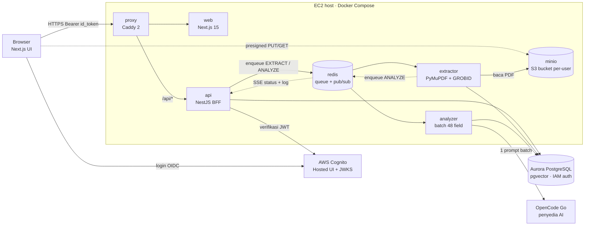
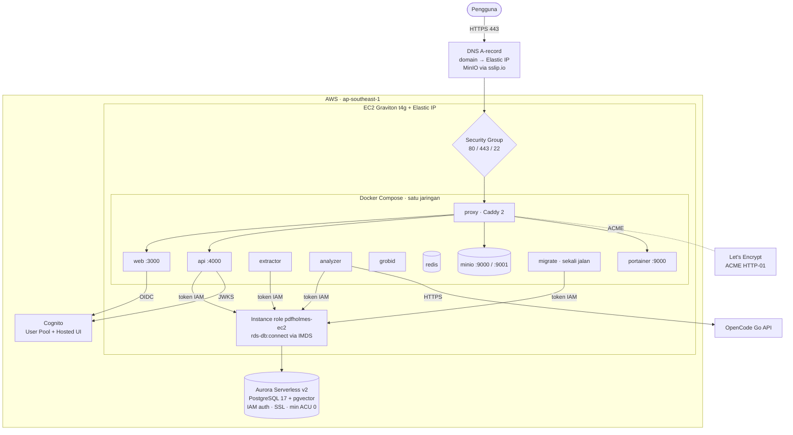

# PDFHo!mes

PDFHo!mes membaca artikel riset dalam format PDF dan membongkarnya menjadi 48 field
analisis terstruktur, lengkap dengan deteksi celah riset (research gap), dalam bahasa
yang Anda pilih. Satu penyedia mengerjakan seluruh bagian AI-nya: OpenCode Go.

Aplikasi berjalan publik di https://pdfholmes.stevewithcode.net dengan login Amazon
Cognito.

## Cara kerjanya

Anda mengunggah satu PDF. PDFHo!mes menyimpannya, menarik teks dan strukturnya, lalu
meminta OpenCode Go mengisi 48 field analisis dalam satu prompt JSON untuk semua field
sekaligus. Hasilnya mengalir ke layar lewat SSE, jadi field terisi satu per satu saat
Anda menonton, bukan menunggu layar kosong sampai semuanya selesai.

```
unggah → MinIO
   └▶ extractor : PDF → teks + struktur (PyMuPDF + GROBID) → tabel extractions
        └▶ analyzer : teks + struktur → 1 prompt batch → OpenCode Go → analysis_sections
             └▶ web  : 48 field tampil live lewat SSE
```

Di bawah panel analisis ada kotak "Log pemrosesan": kotak bergulir tinggi tetap yang
menampilkan tiap langkah pipeline secara langsung, termasuk respons mentah dari API AI.
Kotak ini berguna saat sebuah dokumen lambat atau gagal, karena Anda bisa melihat di
tahap mana prosesnya berhenti.

Semua bagian berjalan sebagai container Docker dalam satu jaringan:

| Service | Stack | Tugasnya |
|---|---|---|
| `web` | Next.js 15 + Auth.js | Tampilan, login Cognito, viewer PDF, panel 48 field, log pemrosesan |
| `api` | NestJS | Verifikasi token, CRUD, presigned URL, antrian, SSE |
| `extractor` | Python (PyMuPDF + GROBID) | PDF menjadi teks dan struktur, ditulis ke tabel `extractions` |
| `analyzer` | Python + OpenCode Go | Satu prompt batch untuk 48 field, ditulis ke `analysis_sections` |
| `grobid` | GROBID | Parsing artikel ilmiah menjadi TEI XML (judul, abstrak, section, referensi) |
| `redis` | redis:7 | Antrian job dan pub/sub status |
| `minio` | MinIO | Penyimpanan PDF, satu bucket per pengguna |
| `proxy` | Caddy 2 | HTTPS otomatis dan routing |
| `portainer` | Portainer CE | UI manajemen Docker (port 9443, di belakang Caddy) |

Database memakai Aurora PostgreSQL Serverless v2 dengan pgvector, diakses lewat IAM
auth. Database terpisah dari container, jadi tidak ada service Postgres di tabel di
atas. Service `migrate` menyambung ke Aurora via IAM dan menerapkan migrasi saat `up`.

Relasi antar-komponen dijelaskan di [`docs/ARCHITECTURE.md`](./docs/ARCHITECTURE.md).

## Arsitektur

### Pandangan umum

Diagram berikut menunjukkan komponen yang berjalan dan ke mana datanya mengalir.
Kotak di dalam "EC2 host" adalah container Docker dalam satu jaringan; tiga kotak di
luar adalah layanan terkelola dan API eksternal.



Bagaimana elemen-elemen ini berhubungan:

- Browser dan Cognito: login memakai Authorization Code dengan PKCE ke Hosted UI
  Cognito. Browser menyimpan `id_token` dan mengirimnya sebagai Bearer ke `api`.
- Browser dan proxy: semua trafik HTTPS masuk lewat Caddy. Caddy meneruskan `/api/*`
  ke `api` dan sisanya ke `web`, jadi web dan API berbagi satu origin.
- Browser dan MinIO: upload dan tampilan PDF memakai URL presigned, jadi berkas
  mengalir langsung antara browser dan MinIO tanpa membebani `api`.
- api dan Cognito: `api` memverifikasi tiap token lewat JWKS publik Cognito dan
  mencocokkan issuer serta audiens sebelum melayani permintaan.
- api dan redis: `api` tidak memproses PDF sendiri. Ia menaruh job `EXTRACT` dan
  `ANALYZE` ke antrian Redis, lalu worker mengambilnya. Status balik ke browser lewat
  pub/sub Redis yang diteruskan `api` sebagai SSE.
- extractor dan analyzer: `extractor` membaca PDF dari MinIO, menulis hasil parser ke
  Aurora, lalu meng-enqueue `ANALYZE`. `analyzer` mengirim satu prompt batch ke
  OpenCode Go dan menyimpan 48 field ke Aurora.
- Semua worker dan Aurora: penyimpanan data terpusat di Aurora. Worker dan `api`
  menulis ke tabel yang sama, terpisah per `user_id`.

### Pandangan deploy dan komputasi awan

Diagram ini fokus pada tempat semuanya berjalan di AWS, plus dua dependensi eksternal
(Let's Encrypt dan OpenCode Go).



Bagaimana lapisan deploy ini berhubungan:

- Satu host menjalankan semuanya. Seluruh stack hidup di satu instance EC2 Graviton
  (`t4g`) dengan Elastic IP supaya alamatnya tetap saat instance di-restart. DNS hanya
  butuh satu A-record ke Elastic IP itu; host MinIO memakai `sslip.io` yang memetakan
  IP ke hostname tanpa perlu DNS tambahan.
- Caddy adalah satu-satunya pintu masuk. Security Group hanya membuka port 80, 443, dan
  22 (SSH dibatasi IP Anda). Caddy menerbitkan dan memperbarui sertifikat TLS sendiri
  lewat tantangan ACME HTTP-01 ke Let's Encrypt, lalu mem-proxy ke `web`, `api`, MinIO,
  dan Portainer. Port internal container (3000, 4000, 9000, 9443) tidak diekspos ke
  internet.
- Database terkelola dan terpisah. Aurora berada di luar EC2, bukan container. Ia
  PostgreSQL Serverless v2 dengan pgvector dan min ACU 0, jadi cluster tidur saat idle.
- Akses database tanpa password statis. `api`, `extractor`, `analyzer`, dan `migrate`
  tidak menyimpan kredensial DB. Instance role EC2 `pdfholmes-ec2` punya izin
  `rds-db:connect`; tiap service mengambil identitas itu lewat IMDS, membuat token IAM
  15 menit, dan menyambung ke Aurora dengan SSL.
- Identitas pengguna dari Cognito. `web` mengarahkan login ke Hosted UI Cognito (OIDC),
  dan `api` memvalidasi token lewat JWKS Cognito. Tidak ada penyimpanan password di
  aplikasi.
- AI keluar lewat satu jalur. Hanya `analyzer` yang memanggil OpenCode Go, lewat HTTPS,
  memakai key server. Tidak ada komponen lain yang menyentuh penyedia AI.
- `grobid` dan `migrate` adalah pelengkap. `migrate` jalan sekali saat `up` untuk
  menerapkan migrasi lalu keluar. `grobid` memperkaya parsing dan boleh dimatikan pada
  host ber-RAM kecil tanpa menghentikan pipeline.

## Analisis: OpenCode Go

PDFHo!mes bukan aplikasi BYOK. Pengguna tidak pernah memasukkan API key. Seluruh
aplikasi berbagi satu langganan OpenCode Go yang disetel di server lewat
`OPENCODE_GO_API_KEY`. Key itu hanya hidup di backend (service `analyzer`) dan tidak
pernah sampai ke browser, bundle frontend, log, atau pesan error.

Analisis 48 field dikerjakan `analyzer` dalam satu panggilan batch. Semua field dikirim
dalam satu prompt, dijawab sebagai satu JSON, lalu divalidasi dan disimpan per field ke
`analysis_sections`. Satu panggilan jauh lebih hemat token dan menghindari rate limit
dibanding 48 panggilan terpisah. Untuk dokumen besar yang lambat dijawab model, batas
waktu panggilan diatur lewat `OPENCODE_GO_TIMEOUT_S` (default 900 detik).

Langganan, key, model, dan parameter analisis: [`docs/OPENCODE.md`](./docs/OPENCODE.md).

## Menjalankan stack

Stack berjalan dari satu host EC2 dengan Docker Compose. Konfigurasinya ada di `.env`,
yang tidak ikut di Git.

```bash
docker compose -f infra/docker-compose.yml --env-file .env up -d
```

Database eksternal (Aurora), jadi tidak ada container Postgres. Cukup compose dasar.
Service `migrate` menyambung ke Aurora via IAM dan menerapkan migrasi otomatis saat
`up`. Detail: [`docs/DATABASE.md`](./docs/DATABASE.md).

Cek kesehatan:

```bash
curl https://pdfholmes.stevewithcode.net/api/health         # {"status":"ok"}
curl https://pdfholmes.stevewithcode.net/api/health/ready   # db dan redis ok
```

Menyiapkan dari awal (domain, Cognito, AWS): [`docs/DEPLOY.md`](./docs/DEPLOY.md).

## Dokumentasi

| Dokumen | Isi |
|---|---|
| [`docs/DEPLOY.md`](./docs/DEPLOY.md) | Langkah deploy lengkap di EC2: Cognito, domain, Docker |
| [`docs/ARCHITECTURE.md`](./docs/ARCHITECTURE.md) | Bagaimana Cognito, MinIO, database, dan OpenCode Go saling terhubung |
| [`docs/COGNITO.md`](./docs/COGNITO.md) | Login Cognito: provisioning, env, troubleshooting |
| [`docs/OPENCODE.md`](./docs/OPENCODE.md) | OpenCode Go: langganan, key, model, parameter, alur analisis |
| [`docs/DOMAIN.md`](./docs/DOMAIN.md) | DNS, Elastic IP, dan TLS untuk domain |
| [`docs/DATABASE.md`](./docs/DATABASE.md) | Aurora PostgreSQL dan pgvector via IAM auth: konfigurasi dan backup |

## Struktur repo

```
apps/web                 UI Next.js (panel 48 field, log pemrosesan)
apps/api                 BFF NestJS
services/extractor       worker PDF menjadi teks (PyMuPDF + GROBID)
services/analyzer        worker analisis batch (OpenCode Go)
packages/field-schema    48 field, satu sumber kebenaran (JSON) untuk TS dan Python
packages/shared-types    tipe TS bersama
db/                      migrasi SQL dan runner
infra/                   docker-compose, Caddyfile, Dockerfile
infra/aws/               Terraform: Cognito dan pendukung Aurora
```
